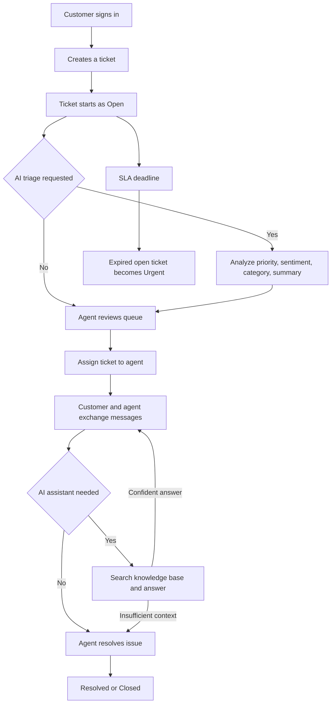
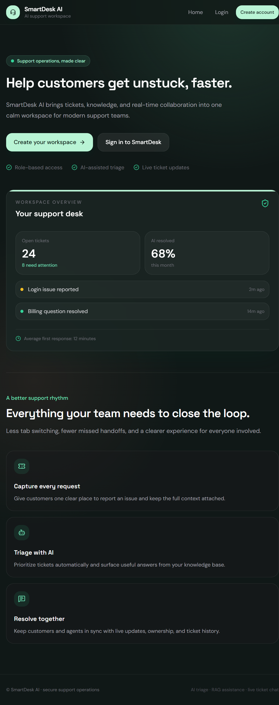
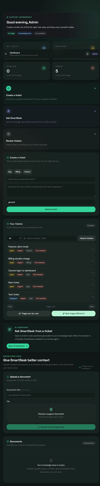
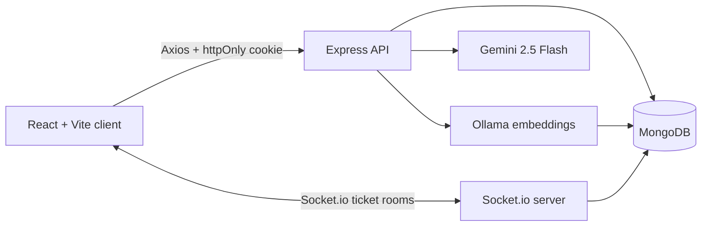

# SmartDesk AI

SmartDesk AI is a full-stack helpdesk platform for handling customer support requests from intake to resolution. It combines a ticketing system, role-based workspaces, real-time conversations, a knowledge base, AI ticket triage, and a retrieval-augmented AI assistant.

The project demonstrates how a support operation can reduce repetitive Tier-1 work without removing human control. AI suggests priority, sentiment, category, summaries, and replies; agents remain responsible for assignment, communication, and resolution.

  

## Contents

- [What the project helps with](#what-the-project-helps-with)
- [How the workflow works](#how-the-workflow-works)
- [User roles](#user-roles)
- [Main features](#main-features)
- [Screenshots](#screenshots)
- [Technology stack](#technology-stack)
- [Architecture](#architecture)
- [AI and RAG workflow](#ai-and-rag-workflow)
- [Run locally](#run-locally)
- [Demo accounts](#demo-accounts)
- [Using the application](#using-the-application)
- [API overview](#api-overview)
- [Security and reliability](#security-and-reliability)
- [Testing](#testing)
- [Deployment](#deployment)
- [Troubleshooting](#troubleshooting)
- [Project structure](#project-structure)

## What the project helps with

Support teams commonly lose time because requests arrive through disconnected channels, important context is missing, and agents repeatedly answer the same questions. SmartDesk AI addresses that workflow by providing one place to:

- collect and track customer issues as tickets;
- give every ticket a status, priority, category, SLA deadline, owner, and history;
- let customers, agents, and administrators see only the information appropriate to their role;
- use company-owned documents as grounded context for AI answers;
- triage repetitive requests automatically before an agent picks them up;
- keep customer-agent conversations synchronized in real time;
- measure ticket volume, resolution, urgency, and AI-assisted outcomes.

The system is useful as a helpdesk prototype, an internal IT support tool, a customer support portal, or a portfolio project demonstrating MERN, security, real-time communication, and applied AI.

## How the workflow works



### End-to-end example

1. A customer logs in and submits "I was charged twice for my subscription."
2. SmartDesk stores the request as an `open` ticket and assigns an SLA deadline.
3. An agent or administrator runs AI triage. Gemini returns a likely priority, sentiment, category, and short summary.
4. An agent opens the ticket, assigns ownership, and replies. Messages are stored through REST and broadcast to the ticket's Socket.io room.
5. The agent can ask the AI assistant about the issue. The assistant searches uploaded support documents and answers only from the retrieved context.
6. If the knowledge base does not contain enough evidence, the assistant recommends human escalation instead of inventing an answer.
7. The agent resolves the ticket. The dashboard and admin analytics update the operational picture.

## User roles

| Role | What the role can do |
|---|---|
| Customer | Register, create tickets, view their own tickets, send messages, and ask the AI assistant about a ticket. |
| Agent | View the support queue, assign tickets, update status, message customers, use AI triage and draft replies, and manage knowledge documents. |
| Admin | Everything an agent can do, plus manage users, view analytics, bulk-triage tickets, and administer the workspace knowledge base. |

Access is enforced on the server. The frontend hides navigation that is not relevant to a role, but server-side authorization remains the source of truth.

## Main features

### Ticket management

- Ticket creation with title, description, and category.
- Pagination, search, and status filtering.
- Ticket lifecycle: `open`, `assigned`, `resolved`, and `closed`.
- Priority levels including `Urgent`, `High`, `Medium`, and `Low`.
- Assignment and ownership controls for agents and admins.
- Ticket history and message conversation.
- SLA countdown based on a 24-hour deadline.

### AI support tools

- **AI triage:** predicts priority, sentiment, category, and summary.
- **AI chat:** answers questions using relevant knowledge-base chunks and ticket context.
- **Draft reply:** prepares a suggested response for an agent to review.
- **Bulk triage:** lets admins process multiple open tickets efficiently.
- **Escalation fallback:** the assistant recommends a human when retrieval returns no useful context.

### Knowledge base

Agents and admins can upload `.txt`, `.md`, `.json`, and `.csv` support documents. Documents are split into overlapping chunks, embedded locally, and stored in MongoDB for retrieval.

### Real-time collaboration

Each ticket has a Socket.io room. Users join the room when viewing a ticket, and new messages are broadcast to everyone currently viewing it. REST endpoints remain available as a fallback for loading message history.

### Admin analytics

Admins can view total, open, resolved, urgent, AI-resolved, average-resolution, category, and agent workload information. The dashboard uses Recharts for bar, pie, and time-series visualizations.

## Screenshots

### Landing page



### Admin dashboard



## Technology stack

### Frontend

- **React 19** for the component-based UI.
- **Vite** for development and production builds.
- **React Router** for public, authenticated, and role-aware routes.
- **Tailwind CSS** for responsive styling and design tokens.
- **Axios** for API requests with cookie credentials.
- **Socket.io Client** for live ticket messages.
- **Framer Motion** for restrained page transitions.
- **Lucide React** for interface icons.
- **Recharts** for administrator analytics.

### Backend

- **Node.js 24** with CommonJS modules.
- **Express** for the REST API.
- **Mongoose** for MongoDB models and queries.
- **Socket.io** for real-time ticket rooms.
- **JWT** stored in an httpOnly cookie for authentication.
- **Zod** and `express-validator` for environment and request validation.
- **Helmet**, CORS, rate limiting, HPP, compression, and Mongo sanitization for API hardening.
- **node-cron** for SLA escalation.
- **Winston** and Morgan for application and request logging.

### Data and AI

- **MongoDB** stores users, tickets, messages, ticket history, notifications, and knowledge documents.
- **Gemini 2.5 Flash** generates triage results, chat answers, and draft replies.
- **Ollama + `nomic-embed-text`** creates 768-dimensional local embeddings.
- **JavaScript cosine similarity** retrieves the top three relevant knowledge chunks without requiring a paid vector database.

### Quality and delivery

- **Jest + Supertest** for backend API tests.
- **GitHub Actions** for automated tests and client builds.
- **Docker Compose** for a MongoDB-backed deployment option.
- **Vercel** is suitable for the client and **Render** for the server.

## Architecture



The important boundary is the Express server. The client never talks directly to MongoDB, Gemini, or Ollama. Authentication, role checks, ticket ownership, validation, rate limits, and AI orchestration happen on the server.

### Core data relationships

```text
User 1 ──── * Ticket
User 1 ──── * Message
Ticket 1 ── * Message
Ticket 1 ── * TicketHistory
User 1 ──── * KnowledgeDoc
```

## AI and RAG workflow

The knowledge-grounded assistant follows this sequence:

1. An agent or admin uploads a support document.
2. The server splits the text into chunks of 500 characters with 50 characters of overlap.
3. Ollama generates a 768-value embedding for each chunk.
4. The chunks and vectors are stored in MongoDB.
5. A user asks a question about a ticket.
6. The question is embedded using the same model.
7. The server computes cosine similarity against stored vectors and keeps the top three chunks.
8. Gemini receives the ticket context, question, and retrieved chunks with instructions to stay within the supplied evidence.
9. If no useful context is available, the UI presents a human-escalation path instead of pretending the answer is known.

This approach avoids a vector database for the project's scale. Its trade-off is an in-memory linear scan of knowledge documents, which is simple and inexpensive but should be replaced with a vector index or retrieval service at larger scale.

## Run locally

### Prerequisites

- Node.js 24 or a compatible recent Node.js release.
- MongoDB running locally on port `27017`, or a MongoDB Atlas connection string.
- Ollama for knowledge-base embedding features.
- A Gemini API key for AI triage, chat, and draft replies.

### 1. Install dependencies

From the repository root:

```bash
cd server
npm install

cd ../client
npm install
```

### 2. Configure the server

Copy the example environment file:

```bash
cd server
cp .env.example .env
```

On Windows PowerShell:

```powershell
Copy-Item .env.example .env
```

Set the values in `server/.env`:

```env
PORT=5000
MONGO_URI=mongodb://127.0.0.1:27017/smartdesk-ai
JWT_SECRET=replace_with_a_long_random_string
JWT_EXPIRES_IN=7d
CLIENT_URL=http://localhost:5173
GEMINI_API_KEY=your_gemini_api_key
OLLAMA_URL=http://localhost:11434
NODE_ENV=development
```

Never commit `.env` or expose a real API key in the client.

### 3. Start Ollama embeddings

Install Ollama, start the Ollama service, and download the embedding model:

```bash
ollama pull nomic-embed-text
```

Basic login, tickets, and non-AI navigation can run without Ollama. Knowledge-base upload and retrieval require it.

### 4. Seed demo data

Make sure MongoDB is running, then execute:

```bash
cd server
npm run seed
```

The seed script is intentionally non-destructive. If users already exist, it prints `Seed skipped: users exist` and leaves the database unchanged.

### 5. Start the backend

In one terminal:

```bash
cd server
npm run dev
```

The API runs at `http://localhost:5000`.

### 6. Start the frontend

In a second terminal:

```bash
cd client
npm run dev
```

The application runs at `http://localhost:5173`.

Check the backend with `http://localhost:5000/api/health`. The response should contain `{"ok":true,"service":"smartdesk-ai"}`.

## Demo accounts

These accounts are created by `npm run seed` when the database has no users:

| Role | Email | Password |
|---|---|---|
| Admin | `admin@test.com` | `admin123` |
| Agent | `agent@test.com` | `agent123` |
| Customer | `john@test.com` | `customer123` |

Use the login page at `http://localhost:5173/login`.

## Using the application

### Customer journey

1. Sign in as `john@test.com`.
2. Create a ticket from the dashboard or Tickets page.
3. Search and filter your tickets.
4. Open a ticket to read the conversation and send a message.
5. Use AI Assistant to ask a question about the selected ticket.
6. Follow the ticket until an agent resolves it.

### Agent journey

1. Sign in as `agent@test.com`.
2. Open Tickets to review the support queue.
3. Assign a ticket and update its status.
4. Use AI triage to understand priority, sentiment, category, and summary.
5. Upload trusted support documents to the Knowledge Base.
6. Use the AI Assistant or Draft Reply action, then review the generated content before sending it.
7. Reply to the customer in the ticket conversation and resolve the issue.

### Admin journey

1. Sign in as `admin@test.com`.
2. Review dashboard totals and charts.
3. Bulk-triage open tickets when the queue grows.
4. Upload or update knowledge-base material.
5. Review user management and agent workload.
6. Monitor urgent tickets and SLA performance.

## API overview

The API base path is `/api`. Authentication uses an httpOnly `token` cookie.

| Method | Endpoint | Access | Purpose |
|---|---|---|---|
| `POST` | `/auth/register` | Public | Create a customer or agent account. |
| `POST` | `/auth/login` | Public | Authenticate and issue the cookie. |
| `GET` | `/auth/me` | Signed in | Return the current user. |
| `POST` | `/auth/logout` | Signed in | Clear the session cookie. |
| `GET` | `/tickets?page&limit&status&q` | Signed in | List tickets allowed for the current role. |
| `POST` | `/tickets` | Signed in | Create a ticket. |
| `GET` | `/tickets/:id` | Signed in | Return a ticket and its messages. |
| `PATCH` | `/tickets/:id/assign` | Agent/Admin | Assign a ticket. |
| `PATCH` | `/tickets/:id/status` | Signed in | Change ticket status. |
| `POST` | `/tickets/:id/messages` | Signed in | Add a message. |
| `GET` | `/tickets/stats` | Admin | Return operational analytics. |
| `POST` | `/kb/upload` | Agent/Admin | Upload and embed a document. |
| `GET` | `/kb` | Agent/Admin | List knowledge documents. |
| `POST` | `/ai/triage` | Signed in | Generate ticket triage. |
| `POST` | `/ai/chat` | Signed in | Ask a grounded question. |
| `POST` | `/ai/draft-reply` | Signed in | Generate a suggested reply. |
| `GET` | `/health` | Public | Check API availability. |

Socket.io events include `join-ticket`, `send-message`, and `new-message`.

See [docs/api.md](docs/api.md) for the compact API reference.

## Security and reliability

- JWT authentication is stored in an httpOnly cookie rather than browser local storage.
- `protect` middleware verifies sessions before protected routes execute.
- `authorize` middleware limits agent/admin operations.
- Ticket access checks prevent users from reading tickets they do not own or manage.
- Helmet, CORS, compression, HPP, Mongo sanitization, and request validation protect the API boundary.
- General API traffic is rate-limited to 300 requests per 15 minutes.
- AI routes have a stricter limit of 20 requests per minute.
- Gemini generation retries once on a temporary 503 response.
- A cron job runs every minute and marks overdue open or assigned tickets as `Urgent`.
- MongoDB indexes support ticket status, customer ownership, and ticket lookups.

## Testing

Run backend tests:

```bash
cd server
npm test
```

The Jest/Supertest suite covers registration, login, authentication blocking, ticket creation, role checks, and mocked AI triage.

Build the frontend:

```bash
cd client
npm run build
```

Lint the frontend:

```bash
cd client
npm run lint
```

## Deployment

### Separate frontend and backend

- Deploy `client` to Vercel or another static frontend host.
- Deploy `server` to Render, Railway, or a Node-compatible host.
- Use MongoDB Atlas for production persistence.
- Set `CLIENT_URL` to the deployed frontend URL.
- Set `VITE_API_URL` and `VITE_SOCKET_URL` in the client environment.
- Configure `GEMINI_API_KEY`, `JWT_SECRET`, and `MONGO_URI` only in the server environment.
- Set `NODE_ENV=production` and serve the API over HTTPS; production auth cookies use `SameSite=None` and therefore require the `Secure` flag.
- Ensure the server host can reach Ollama, or replace the embedding provider with a hosted embedding service.

### Docker Compose

The repository includes `docker-compose.yml` for running MongoDB and the app together. Review the compose build context and environment values for your deployment host before using it in production. The API is exposed on port `5000`, MongoDB on `27017`, and the client remains a separate Vite/Vercel deployment in the current setup.

## Troubleshooting

### Login fails or the API is unavailable

1. Confirm MongoDB is running on port `27017`.
2. Confirm the backend is running from the `server` directory.
3. Open `http://localhost:5000/api/health`.
4. If the API is healthy but accounts are missing, run `npm run seed` from `server`.
5. Check that the frontend `.env` contains:

```env
VITE_API_URL=http://localhost:5000/api
VITE_SOCKET_URL=http://localhost:5000
```

### Port 5000 is already in use

Do not start a second API process. Check the existing process, or change `PORT` in `server/.env` and update the client URLs to match.

### AI features fail

- Confirm `GEMINI_API_KEY` is set for triage, chat, and draft replies.
- Confirm Ollama is running for embeddings.
- Confirm `nomic-embed-text` is installed with `ollama list`.
- Remember that AI answers depend on the documents uploaded to the knowledge base.

### Seed data is not recreated

The seed command does not delete existing users. To reset development data, remove the development database manually or use a separate MongoDB database. Never reset a production database casually.

## Project structure

```text
smartdesk-ai/
├── client/
│   ├── public/                 # PWA manifest and public assets
│   └── src/
│       ├── components/         # Layout, reusable UI, notifications, error boundary
│       ├── context/            # Auth and API-backed application actions
│       ├── lib/                # Axios client configuration
│       ├── pages/              # Landing, auth, dashboard, tickets, AI, KB, users
│       ├── App.jsx             # Routes and authentication guards
│       └── index.css           # Global design tokens and Tailwind entry point
├── server/
│   ├── src/
│   │   ├── config/             # Environment, database, cache, seed, Swagger
│   │   ├── middleware/         # Auth, validation, and error handling
│   │   ├── models/             # Mongoose schemas
│   │   ├── routes/             # REST API routes
│   │   ├── services/           # AI and retrieval logic
│   │   ├── server.js           # Express and Socket.io bootstrap
│   │   └── socket.js           # Real-time ticket events
│   └── test/                   # Jest and Supertest API tests
├── docs/
│   ├── api.md                  # Endpoint reference
│   ├── architecture.md         # Architecture and data-flow notes
│   └── viva.md                 # Presentation and technical Q&A notes
├── docker-compose.yml
├── vercel.json
└── README.md
```

## Further documentation

- [API reference](docs/api.md)
- [Architecture notes](docs/architecture.md)
- [Viva and presentation preparation](docs/viva.md)
